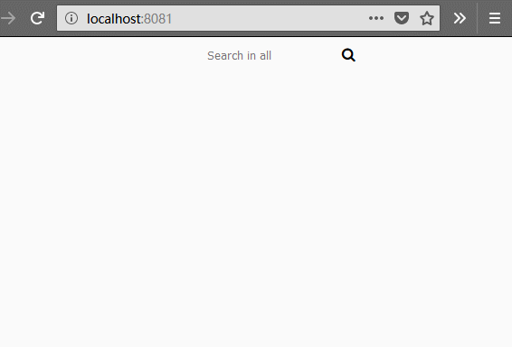

### pelican静态博客  搜索栏  Js工具

基于tipuesearch 插件生成文章json数据；在pelican 建立的静态博客添加搜索工具对全部md文章搜索；效果如下：

本质还是  json数据 jQuery查询 ，也可以改写 用在其他web前端

try：

- 文件夹 打开命令行 
- enter `python -m SimpleHTTPServer 8081`
- http://localhost:8081/  /浏览器打开

如果是其他插件生成的 md 内容结构，需要修改 js脚本

[github >tipuesearch](https://github.com/getpelican/pelican-plugins/tree/master/tipue_search) 生成的文件名 为 tipuesearch_content.json，文档结构如下

~~~json
{"pages": 
    [  
        { "text": "Lorem ipsum dolor sit amet, consectetur ",
            "tags": "Example Category",
            "url" : "http://oncoot.com/plugin-example.html",
            "title": "Everything you warem Ipsum"
        },
        { "text": "Sed ",
            "tags": "Example Category",
            "url" : "http://oncoot.com/plugin-example-2.html",
            "title": "Review of the book Lorem Ipsum"
        }
    ]
}
~~~

### pelican usage:

- 在 pelicanconf.py 配置文件 添加  [tipuesearch](https://github.com/getpelican/pelican-plugins/tree/master/tipue_search)  插件

  ​

- 主题中 选择模板 添加  搜索表单

  ​

- 添加 脚本到自己的custom.js，或者直接放置到output folder,  对应修改 脚本来源路径   ``

  ​

- 可以自己改写css样式 或者用别。  pelicanconf.py中指定 `CUSTOM_CSS = "/custom.css"` ，或者在html 模板中指定 css路径   `<link href="/custom.css" rel="stylesheet" type="text/css" />`。

  ​

- 渲染模板"make html"；    "make publish"会清空output 文件夹

  ​

- serve

  ​

### enjoy it

recommend  "pelican-toc" plugin for md contents